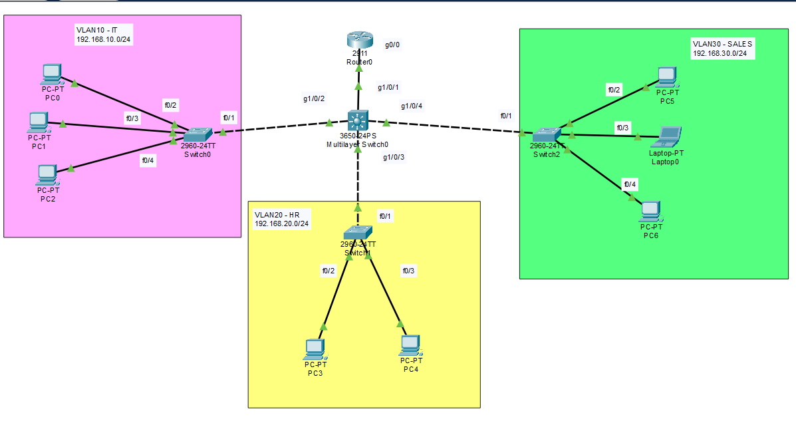
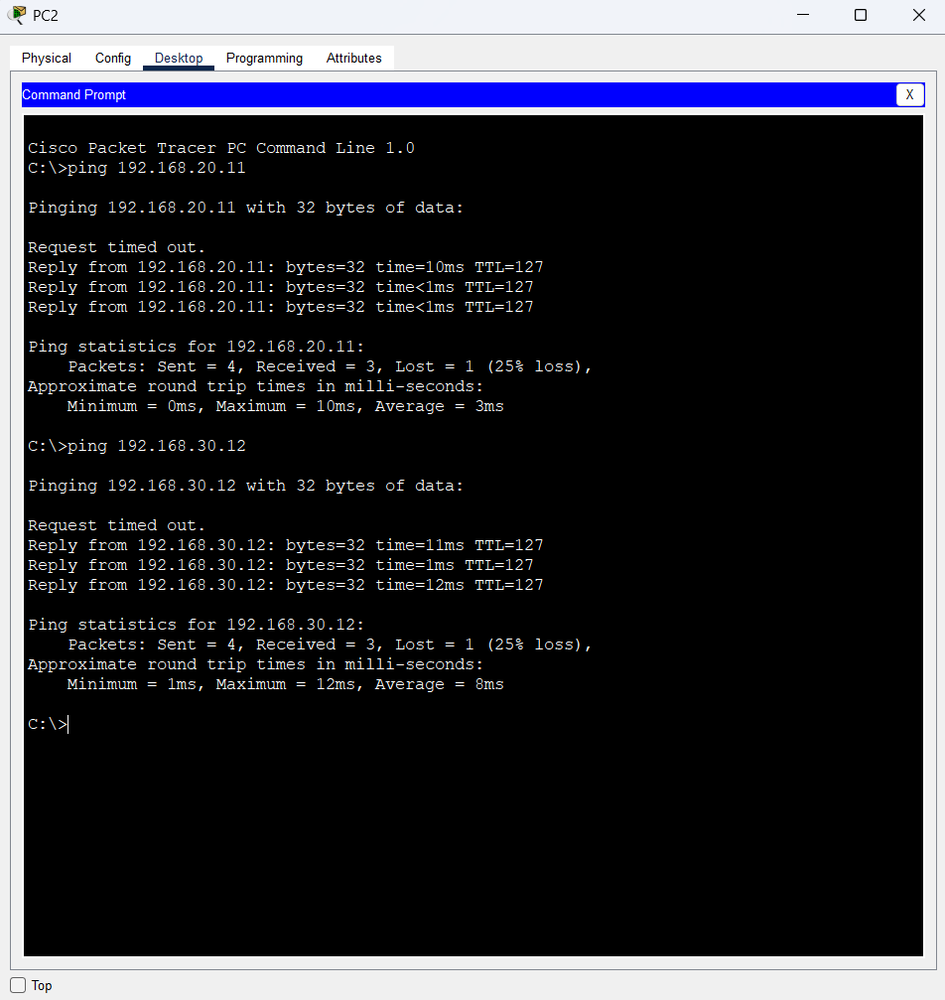

# Inter-VLAN Routing with DHCP

A Cisco Packet Tracer lab demonstrating **inter-VLAN routing and DHCP** using a router, multiple switches, and three VLANs.

## Topology

## VLANs & IP Addrerssing
| VLAN | Department | Network | Gateway |
|---|---|---|---|
| VLAN 10 | IT | `192.168.10.0/24` | `192.168.10.1` |
| VLAN 20 | HR | `192.168.20.0/24` | `192.168.20.1` |
| VLAN 30 | SALES | `192.168.30.0/24` | `192.168.30.1` |

## Configuration
#### VLANs
    vlan 10
    name IT

    vlan 20
    name HR

    vlan 30
    name SALES

#### Switch - Access Port
    interface range f0/2-24
    switchport mode access
    switchport access vlan 10

The same access-port configuration was applied to VLAN 20 and VLAN 30 switches with their respective VLAN IDs.

#### Switch - Trunk Port
    interface f0/1
    witchport mode trunk

#### 3650-34PS Multilayer Switch
    vlan 10
    name IT

    vlan 20
    name HR

    vlan 30
    name SALES

    interface range g1/0/1-4
    switchport mode trunk

#### Router - Subinterfaces
    interface g0/0
    no shutdown

    interface g0/0.10
    encapsulation dot1Q 10
    ip address 192.168.10.1 255.255.255.0

    interface g0/0.20
    encapsulation dot1Q 20
    ip address 192.168.20.1 255.255.255.0

    interface g0/0.30
    encapsulation dot1Q 30
    ip address 192.168.30.1 255.255.255.0

#### DHCP Configuration
##### IT
    ip dhcp pool IT-LAN
    network 192.168.10.0 255.255.255.0
    default-router 192.168.10.1
    dns-server 1.1.1.1

##### HR
    ip dhcp pool HR-LAN
    network 192.168.20.0 255.255.255.0
    default-router 192.168.20.1
    dns-server 1.1.1.1

##### SALES
    ip dhcp pool SALES-LAN
    network 192.168.30.0 255.255.255.0
    default-router 192.168.30.1
    dns-server 1.1.1.1

#### Excluded address
    ip dhcp excluded-address 192.168.10.1 192.168.10.10
    ip dhcp excluded-address 192.168.20.1 192.168.20.10
    ip dhcp excluded-address 192.168.30.1 192.168.30.10
    
## Verificaction
    show vlan brief
    show interfaces trunk
    show ip interface brief
    show ip dhcp binding
## Inter-VLAN Connectivity Test
PC2 in **VLAN 10** successfully pinged devices in:

- **VLAN 20:** `192.168.20.11`
- **VLAN 30:** `192.168.30.12`

## Concepts Practiced
- VLANs
- Access & trunk ports
- 802.1Q
- Router subinterfaces
- Inter-VLAN routing
- DHCP
- DHCP address exclusions
- IP addressing
- Default gateways
- Basic network troubleshooting