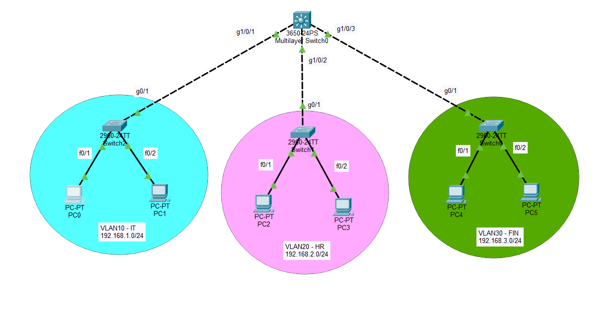
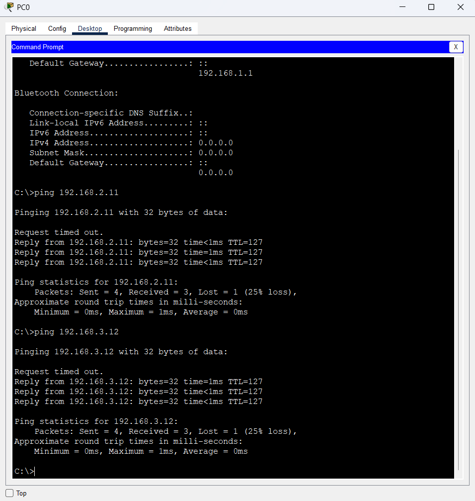

# Inter-VLAN Routing with Layer 3 Switch

A Cisco Packet Tracer lab demonstrating **inter-VLAN routing using a Cisco Layer 3 switch**. The Layer 3 switch also provides DHCP services for each VLAN.

## Topology

## VLANs & IP Addrerssing

| VLAN | Department | Network | Gateway |
|---|---|---|---|
| VLAN 10 | IT | `192.168.1.0/24` | `192.168.1.1` |
| VLAN 20 | HR | `192.168.2.0/24` | `192.168.2.1` |
| VLAN 30 | FIN | `192.168.3.0/24` | `192.168.3.1` |

## Configuration
### Access Switches

Created the respective VLAN and assigned end-device ports as access ports.

    vlan 10
    name IT

    interface range f0/1-24
    switchport mode access
    switchport access vlan 10

    interface g0/1
    switchport mode trunk

The same configuration was applied for VLAN 20 (HR) and VLAN 30 (FIN) with their respective VLAN IDs.

## Layer 3 Switch Configuration
### Create VLANs
    vlan 10
    name IT

    vlan 20
    name HR

    vlan 30
    name FIN
### Configur Trunk Port
    interface range g1/0/1-3
    switchport mode trunk

### Enable Layer 3 Routing
    ip routing

### Configure SVIs (Switched Virtual Interfaces)
    interface vlan 10
    ip address 192.168.1.1 255.255.255.0
    no shutdown

    interface vlan 20
    ip address 192.168.2.1 255.255.255.0
    no shutdown

    interface vlan 30
    ip address 192.168.3.1 255.255.255.0
    no shutdown

### DHCP Configuration

The Layer 3 switch provides DHCP addresses to the three VLANs.
service dhcp

    ip dhcp pool IT-Pool
    network 192.168.1.0 255.255.255.0
    default-router 192.168.1.1
    dns-server 1.1.1.1

    ip dhcp pool HR-Pool
    network 192.168.2.0 255.255.255.0
    default-router 192.168.2.1
    dns-server 1.1.1.1

    ip dhcp pool FIN-Pool
    network 192.168.3.0 255.255.255.0
    default-router 192.168.3.1
    dns-server 1.1.1.1

### DHCP Excluded Addresses
    ip dhcp excluded-address 192.168.1.1 192.168.1.10
    ip dhcp excluded-address 192.168.2.1 192.168.2.10
    ip dhcp excluded-address 192.168.3.1 192.168.3.10
## Verificaction
    show vlan brief
    show interfaces trunk
    show ip interface brief
    show ip route
    show ip dhcp binding
## Inter-VLAN Connectivity Test
PC0 in **VLAN 10** successfully pinged devices in:

- **VLAN 20:** `192.168.2.11`
- **VLAN 30:** `192.168.3.12`

## Concepts Practiced
- VLANs
- Access & trunk ports
- Layer 3 switching
- SVIs
- Inter-VLAN routing
- DHCP
- DHCP address exclusions
- IP addressing
- Default gateways
- Cisco IOS