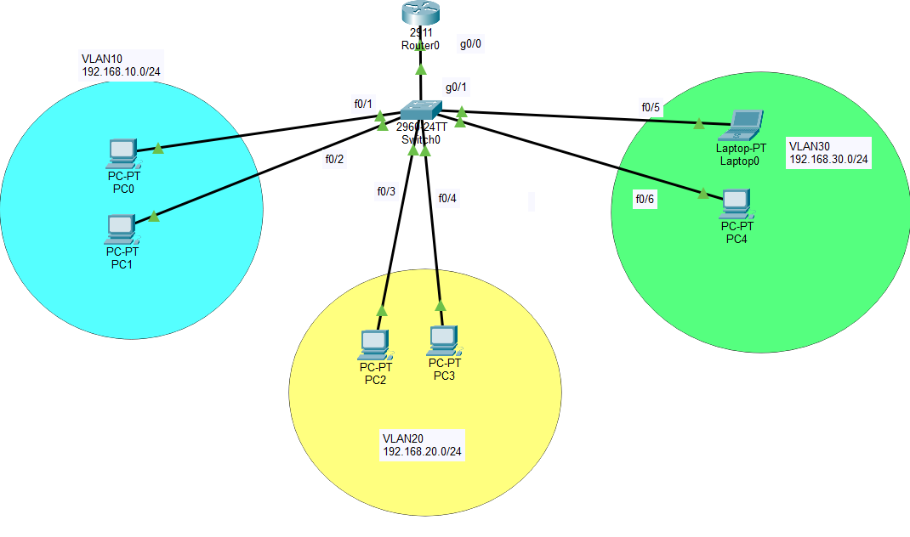
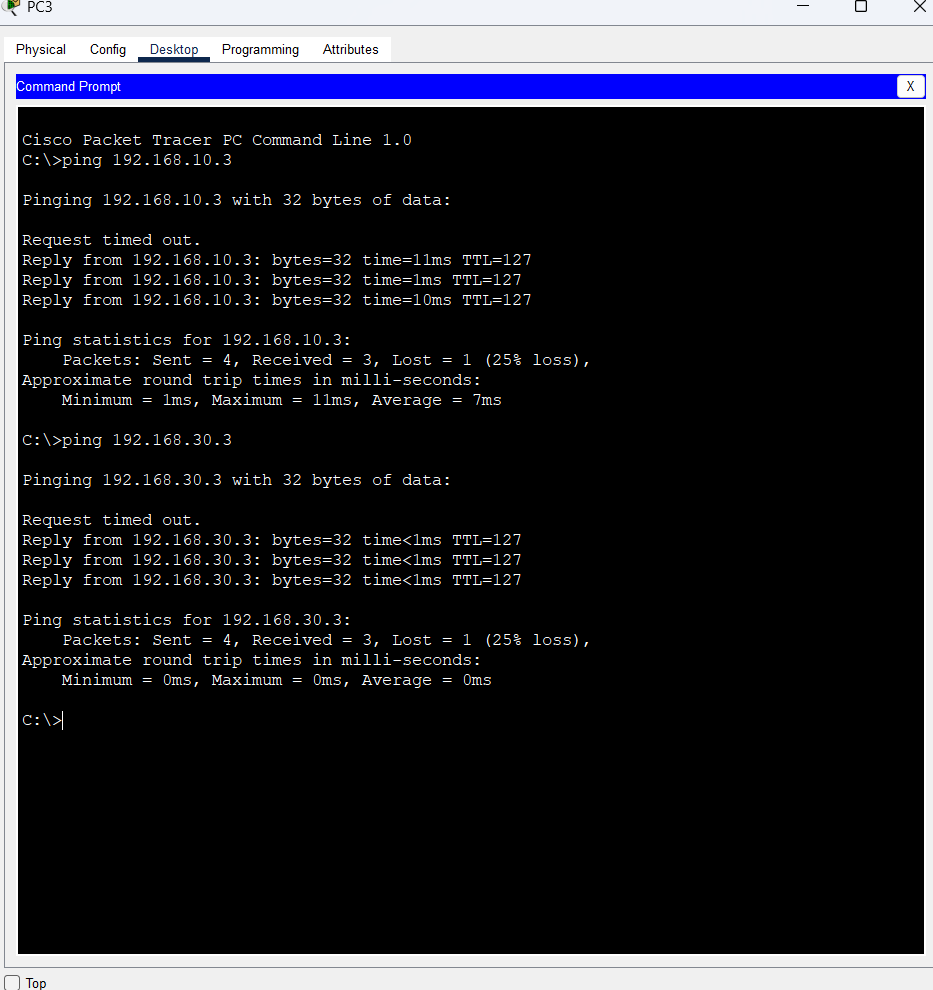

# Router-on-a-Stick

This project demonstrates Router-on-a-Stick (ROAS) using Cisco Packet Tracer.

The lab contains one router, one switch, and three VLANs. Each VLAN has two PCs. The router is used to provide communication between the different VLANs through a single trunk link.

## Topology

## IP Addrerssing
| VLAN    | Network           | Gateway        |
| ------- | ----------------- | -------------- |
| VLAN 10 | `192.168.10.0/24` | `192.168.10.1` |
| VLAN 20 | `192.168.20.0/24` | `192.168.20.1` |
| VLAN 30 | `192.168.30.0/24` | `192.168.30.1` |

## Configuration
#### Switch – VLANs & Access Ports
    vlan 10
    vlan 20
    vlan 30

    interface range fa0/1-2
    switchport mode access
    switchport access vlan 10

    interface range fa0/3-4
    switchport mode access
    switchport access vlan 20

    interface range fa0/5-6
    switchport mode access
    switchport access vlan 30

#### Switch - Trunk Ports
    interface fa0/24
    switchport mode trunk

#### Router - Subinterfaces
    interface g0/0
    no shutdown

    interface g0/0.10
    encapsulation dot1Q 10
    ip address 192.168.10.1 255.255.255.0

    interface g0/0.20
    encapsulation dot1Q 20
    ip address 192.168.20.1 255.255.255.0

    interface g0/0.30
    encapsulation dot1Q 30
    ip address 192.168.30.1 255.255.255.0
    
## Verificaction
    show vlan brief
    show interfaces trunk
    show ip interface brief
## Inter-VLAN Connectivity Test
PC3 in **VLAN 20** successfully pinged devices in:

- **VLAN 10:** `192.168.10.3`
- **VLAN 30:** `192.168.30.3`

## Concepts Practiced
- VLANs
- Access & trunk ports
- 802.1Q
- Router subinterfaces
- Inter-VLAN routing
- IP addressing & default gateways
- Cisco IOS
- Network troubleshooting